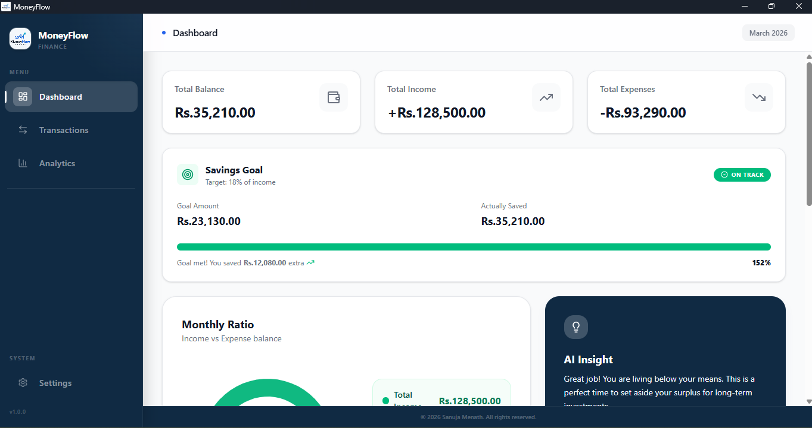

<div align="center">


# MoneyFlow

**A cross-platform financial ecosystem with seamless cloud synchronization.**

Manage your finances on Windows, macOS, and Android perfectly synced, totally secure.

[](https://github.com/SanujaMenath/moneyflow/releases)
[]()
[](LICENSE)
[](https://tauri.app)
[](https://react.dev)

</div>

---

## Overview

MoneyFlow has evolved from a simple desktop tool into a **full-stack financial ecosystem**. By leveraging a **Monorepo architecture**, MoneyFlow provides a unified experience across desktop and mobile devices. 

All data is secured via **Supabase Auth** and synchronized in real-time across platforms using a centralized PostgreSQL database. Whether you're at your desk or on the move, your financial "Single Source of Truth" is always with you.

---
> **v1.0.0** — Initial release. Core tracking, dashboard analytics, and recurring transactions are live.

---

## ✨ Features

- **🔄 Cloud Sync** - Seamless real-time synchronization between Desktop and Mobile apps.
- **📱 Cross-Platform** - Native Windows/macOS experience via Tauri and Android/iOS via Expo.
- **🔐 Secure Authentication** - Personal accounts managed by Supabase Auth with Row Level Security (RLS).
- **📊 Real-time Dashboard** - Instant visual updates of your balance and spending trends.
- **📥 Local Migration** - Built-in bridge to migrate legacy local SQLite data to your cloud account.
- **📅 Recurring Transactions** - Automate your weekly, monthly, or yearly entries.
- **📉 Analytics & Insights** - Detailed category breakdowns and seasonal spending charts.

---

## Screenshots

### Desktop Client


### Mobile Client
Coming soon!...

---

## Tech Stack

| Layer | Technology |
|---|---|
| **Backend / DB** | [Supabase](https://supabase.com) (PostgreSQL + Real-time) |
| **Desktop App** | [Tauri](https://tauri.app) + React + TypeScript |
| **Mobile App** | [Expo](https://expo.dev) (React Native) + Expo Router |
| **Shared Logic** | TypeScript Monorepo Workspaces |
| **Styling** | Tailwind CSS (Desktop) · NativeWind (Mobile) |
| **Charts** | Recharts |
| **Icons** | Lucide React |
| **Storage** | localStorage (v1.0) · SQLite & Supabase |

---

## Getting Started

### Prerequisites

- [Node.js](https://nodejs.org) v18 or later
- [Rust](https://rustup.rs) (stable toolchain)
- [Tauri CLI prerequisites](https://tauri.app/v1/guides/getting-started/prerequisites) for your OS
- [Android Studio](https://developer.android.com/studio) (for Mobile Emulator) or [Expo Go](https://expo.dev/client)

### Installation
```bash
# 1. Clone the repository
git clone https://github.com/SanujaMenath/moneyflow.git
cd moneyflow

# 2. Install dependencies
npm install
```

### Configure Environment
```bash
# Create a .env file in the root with your Supabase credentials:
SUPABASE_URL=your_project_url
SUPABASE_ANON_KEY=your_anon_key
```

### Run
```bash
# 3. Run Desktop
npm run tauri dev

# 4. Run Mobile
cd mobile
npx expo start
```

### Build for production
```bash
npm run tauri build
```

The compiled installer will be output to `src-tauri/target/release/bundle/`.

---

## Project Structure
```
moneyflow/
├── desktop/           # Tauri + React project (Windows/macOS)
│   ├── src/           # Frontend UI logic
│   └── src-tauri/     # Rust backend and system config
├── mobile/            # Expo project (Android/iOS)
│   ├── app/           # Expo Router file-based navigation
│   └── components/    # Native UI components
├── shared/            # Common TypeScript types and Supabase config
└── package.json       # Monorepo workspace configuration
```

---

## Roadmap

- [x] Initial Desktop Release (v1.0)
- [x] Supabase Cloud Integration
- [x] Real-time Sync Engine
- [x] Android Mobile Client (Expo)
- [x] Local-to-Cloud Data Migration Bridge
- [ ] iOS Deployment
- [ ] Shared "Service Layer" for business logic
- [ ] PDF Financial Report Generation
- [ ] AI-Powered Spending Predictions

---

## Contributing

Contributions are welcome. If you find a bug or have a feature suggestion, please [open an issue](https://github.com/SanujaMenath/moneyflow/issues) first before submitting a pull request.
```bash
# Fork the repo, then:
git checkout -b feature/your-feature-name
git commit -m "feat: add your feature"
git push origin feature/your-feature-name
```

---

## License

MIT © 2026 [Sanuja Menath](https://github.com/SanujaMenath)

---

<div align="center">
  <sub>MoneyFlow · Built with care by Sanuja Menath</sub>
</div>